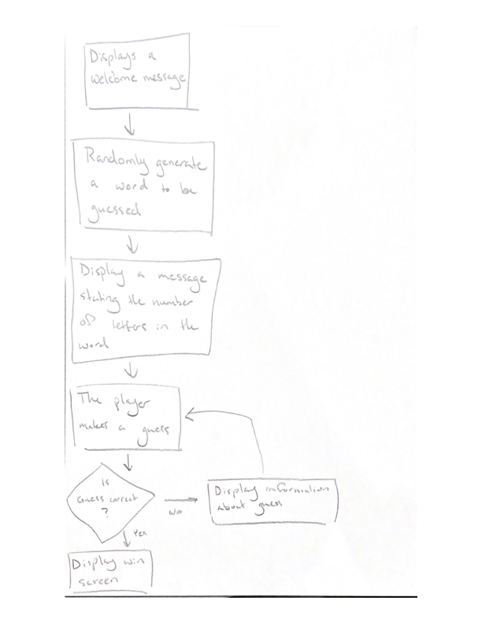
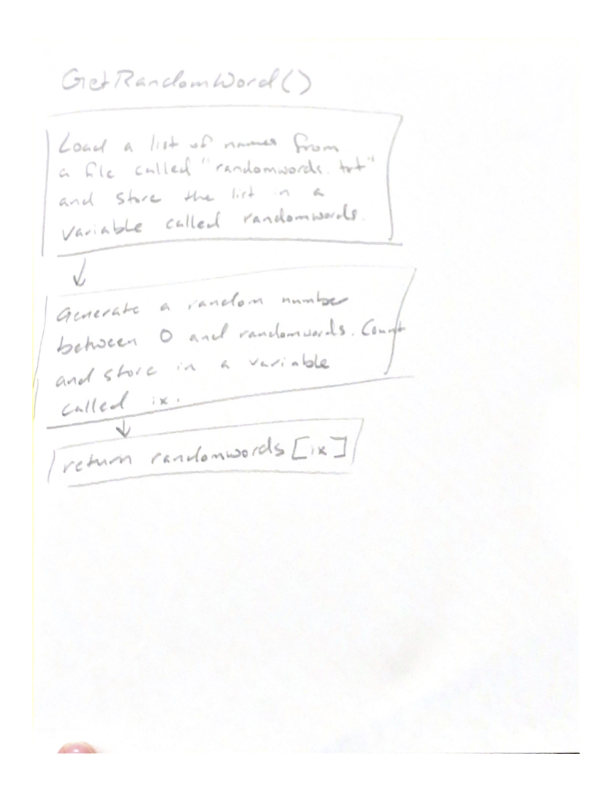
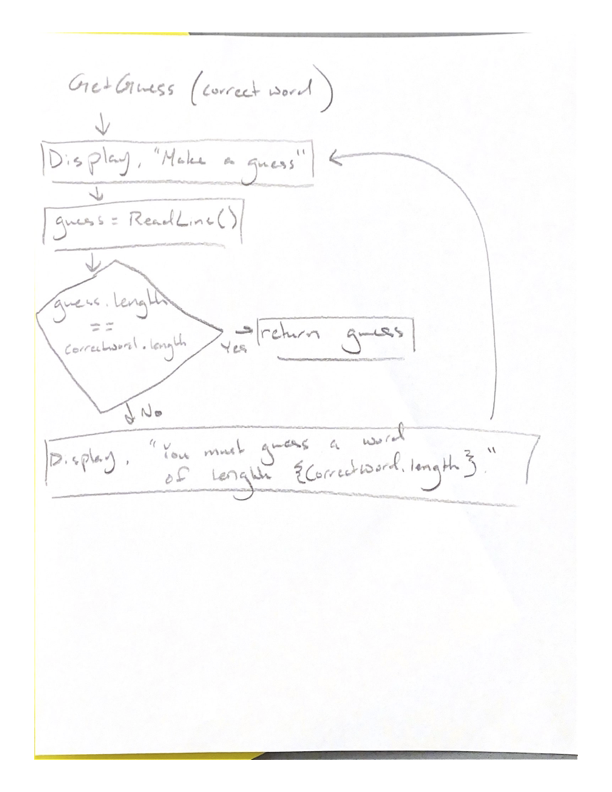
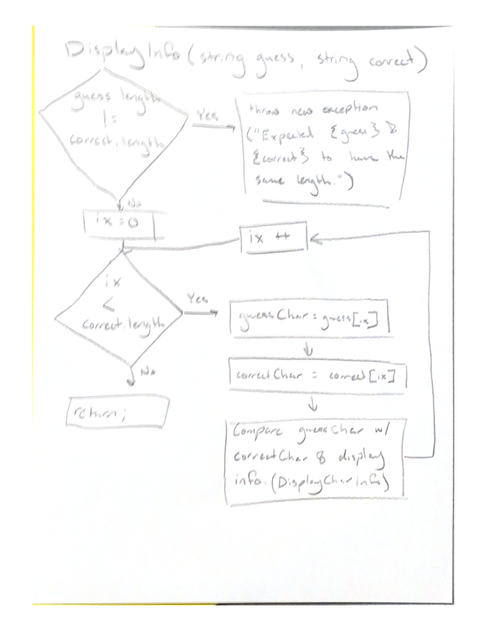
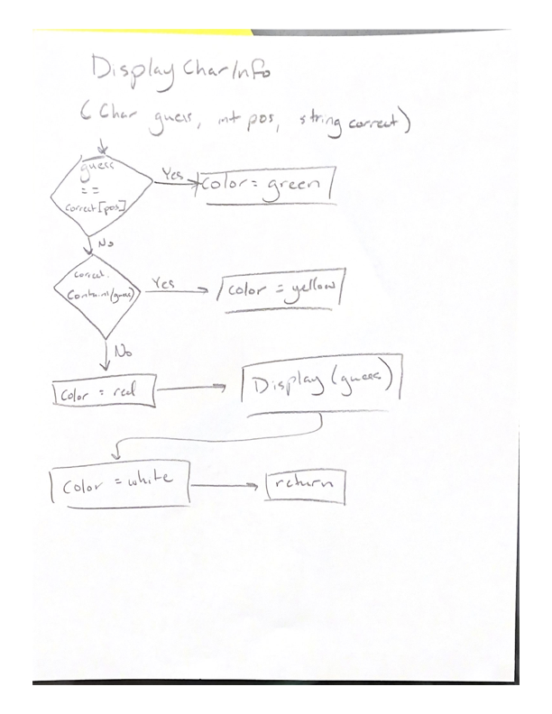

# WordleProject

# Description

Wordle is a game where the user attempts to guess a word. Initially, the user only knows the length of the word. For example, they know the number of letters in the word. When they make a guess, they are told which letters they guessed are in the word, which letters are not in the word, and which letters are in the word and in the correct location.

# Overview

The purpose of Wordle is to provide entertainment to the user playing the game. Wordle accepts guesses from the user by using keyboard inputs. The result of each guess is then written to the console.

# High Level Design

At a high level the game works in the following way:

1. Displays a Welcome Message
2. A random word is then generated
3. The player is asked to make a guess
4. If the guess is correct, the player wins
5. If the guess is incorrect:
   - The player receives information based on their guess
   - The game continues to step 3

# Flow Chart 1 

# Methods

The process for generating a random word and handling the player's guess is a little complex. To help with the complexity, I have used 4 methods to help with such complexity: void GetRandomWord(), string GetGuess(string correctWord), void DisplayInfo(string guess, string correct), and void DisplayCharInfo(char guess, int pos, string correct)

# GetRandomWord()

Randomly generates a random word to be guessed.

1. Load a filed called words.txt
2. Store each line as a separate word in a list named randomwords
3. Generate a random number between 0 and randomwords.Count and store the result in a variable called ix
4. Return the word at position ix. (e.g. words[ix])

# string GetGuess(string correctWord)

Asks the user to make a guess and validates the input before returning the guess.

1. Prompt the user to make a guess
2. Read input from the keyboard and store the results in a variable named guess
3. If guess is the correct length (the guess and random word should be the same length), return the guess.
4. Otherwise, display an error message and ask them to make another guess.

# void DisplayInfo(string guess, string correct)

Given a guess and the correct word to be guessed, displays the guess to the screen coloring each character based on its position and if it is in the correct word.

1. Validate that the guess and correct word are the same length
2. If the lengths do not match, throw an exception
3. If they match, iterate through each character:
- Use the DisplayCharInfo method to determine what color to print the character

# void DisplayCharInfo(char guess, int pos, string correct)

Given a guessed character, the position of that guess, and the correct word, select the correct color for the guess and write it to the console.

1. If the guess is in the correct position, select the color green.
2. If the guess is in the correct word but not correct position, select yellow.
3. If the guess is not in the correct word, select red.
4. Display the guess
5. Reset the color back to white before returning